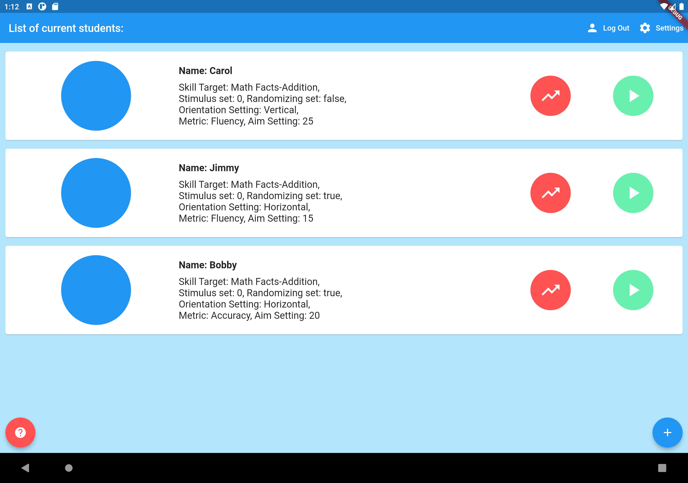
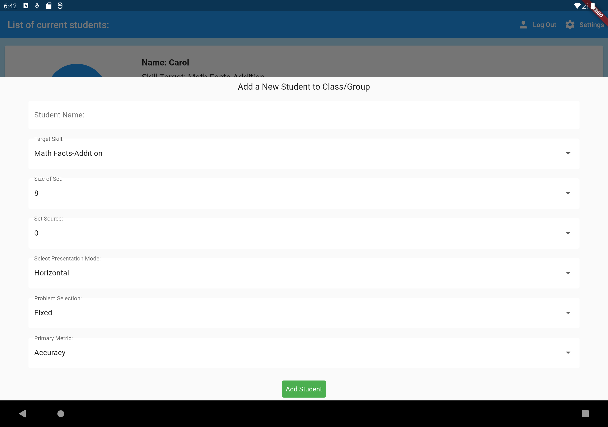

# Cover-Copy-Compare: Math Facts

This project (c/n Takuan) is an initial implementation of Cover-Copy-Compare (an established approach for instructional support) specific to the acquisition of basic math facts. This particular implementation is begin crafted to support comparisons of high- (i.e., tablet-based) and low-tech modalities for implementing Cover-Copy-Compare.

### Features

-   Native views in both iOS and Android
-   Sync trial-level student feedback to cloud
-   Stimulus sets and associated procedures are derived from established tools

### Images

Classroom-level student access

Real-time editing of student support strategies (e.g., set size, randomization, varying set)

Implementation of Cover-Copy-Compare (paper free!)

### Version

-   0.0.0.1 - Alpha

### Derivative Works

Materials included in Takuan are derivative of work:

-   [Measures & Interventions for Numeracy Development](https://brianponcy.wixsite.com/mind/cover-copy-compare) - License Unknown (but permission granted) - Copyright Brian Poncy. <https://brianponcy.wixsite.com/mind/>

### Acknowledgements and Credits

Everyone who has conducted research with Cover, Copy, and Compare strategies.

### Installation

Takuan can be installed as either an Android or iOS application. No builds or binaries yet supplied. Should build just fine for you (though you'd need your own Firebase deets).

### Development

This is currently under active development and evaluation.

## ##\# License

Takuan - Copyright Shawn Gilroy, Louisiana State University. MIT
